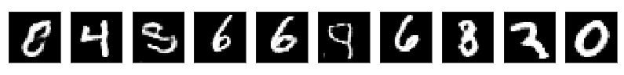
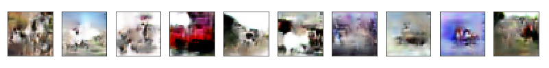

# pytorch-gan


torch 1.4


## References


> [eriklindernoren-Pytorch-GAN](https://github.com/eriklindernoren/PyTorch-GAN)


## GAN


> Goodfellow I., Pouget-Abadie J., Mirza M., Xu B., Warde-Farley D., Ozair S., Courville A. & Bengio Yoshua. Generative adversarial nets. ICLR, 2014.


```
python gan.py mnist
python gan.py cifar10
```


## DCGAN


> Radford A. & Metz L. Unsupervised representation learning with deep convolutional generative adversrial networks. ICLR, 2016.


```
python dcgan.py mnist
python dcgan.py cifar10
```




