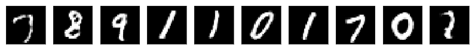
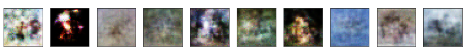
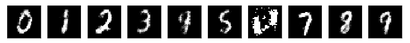
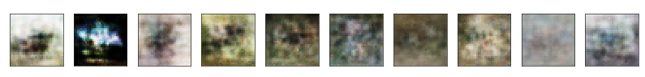
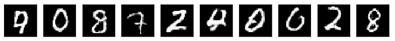
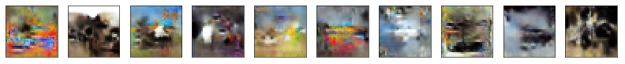
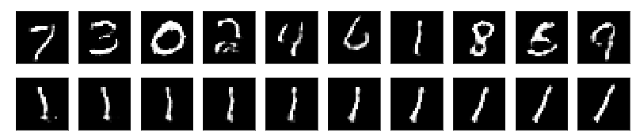
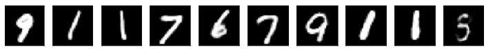

# pytorch-gan


torch 1.4


## References


> [eriklindernoren-Pytorch-GAN](https://github.com/eriklindernoren/PyTorch-GAN)


## GAN


> Goodfellow I., Pouget-Abadie J., Mirza M., Xu B., Warde-Farley D., Ozair S., Courville A. & Bengio Yoshua. Generative adversarial nets. ICLR, 2014.


```
python gan.py mnist
python gan.py cifar10
```







## CGAN


> Mirza M & Osindero S. Conditional Generative Adversarial Nets. arXiv preprint arXiv 1411.1784, 2014.


```
python cgan.py mnist
python cgan.py cifar10
```







## LAPGAN


> Denton E., Chintala S., Szlam A. & Fergus R. Deep Generative Image Models using a Laplacian Pyramid of Adversarial Networks. arXiv preprint arXiv 1506.05751, 2015.


```
python lapgan.py mnist
python lapgan.py cifar10
```


**FAIL TO IMPLEMENT IT.**

**remark:** I feel troublesome to implement it exactly which has so many hyper parameters to control for different datasets. Therefore, I just try a simple way to implement it which could be used in both MNIST and CIFAR-10.


## DCGAN


> Radford A. & Metz L. Unsupervised representation learning with deep convolutional generative adversrial networks. ICLR, 2016.


```
python dcgan.py mnist
python dcgan.py cifar10
```







## InfoGAN


> Chen X., Duan Y., Houthooft R., Schulman J., Sutskever I., Abbeel P. InfoGAN: Interpretable Representation Learning by Information Maximizing Generative Adversarial Nets. arXiv preprint arXiv 1606.03657, 2016. 


```
python infogan.py mnist --dim_noise=62 --dim_code=2
python infogan.py cifar10 --dim_noise=128 --dim_code=4
```





**remark:** I feel puzzled why the top row, which should show logits from 0 to 9,  is out-of-order yet. On the other hand, some implementations use another optimizer to train both generator and discriminator for info loss, however, I found no use at all in practice. Maybe some hyper paramters should be tuned more carefully.


## EBGAN

> Zhao J., Mathieu M. & LeCun Y. Energy-based generative adversarial networks. ICLR, 2017.


```
python ebgan.py mnist
```


